# Diagrams — the artifact, its law, and its evidence

Eleven diagrams. Each answers exactly one question and carries nothing else. They exist for the
three cases prose in this repository handles badly: an **absence** (a path that deliberately does
not exist), a **short-circuit** (an evaluation order that makes "at most one" structural), and a
**cycle** (a defect that cannot be fixed by editing the bytes it was found in). Everything that is
genuinely a list or a comparison stays a table, here and in the documents these link to.

Read in order. A draws the boundary and the law. B follows one request through it. C is how the
evidence and the repository fit together.

| | Question |
|---|---|
| [A1](#a1--the-division-of-labour-and-the-paths-that-do-not-exist) | What does the engine decide, and what stays mine? |
| [A2](#a2--the-decision-law-frozen-precedence-and-first-match-short-circuit) | How does one obligation's fact profile become one of four classes? |
| [A3](#a3--six-answers-from-two-different-authorities) | What can come back, and which of these did the law not assign? |
| [A4](#a4--the-preflight-and-the-calibration-cliff) | Will the preflight say anything useful about my records? |
| [B1](#b1--one-request-end-to-end-and-the-three-places-it-can-stop) | What happens to my bytes, and where does it stop early? |
| [B2](#b2--what-the-envelope-binds-and-the-one-thing-it-does-not) | Holding an envelope, what can I recompute, and what am I still trusting? |
| [C1](#c1--one-trust-root-and-everything-that-hangs-off-it) | What does a green check in this repository actually buy me? |
| [C2](#c2--the-repository-by-class-and-the-errata-loop) | Which bytes may I change, and what happens when a defect lands in bytes that may not? |
| [C3](#c3--what-has-been-pointed-at-this-engine-and-the-shape-of-the-hole) | What is independently checked, and what is checked only by the reference against itself? |
| [C4](#c4--the-evidence-chain-what-pins-what-and-which-verifier-recomputes) | Holding a green verifier line, what did that verifier actually check? |
| [C5](#c5--the-verification-surface-which-lane-runs-which-gate) | Which gate fires without a person, and which does not? |
| [Appendix](#appendix--the-thirty-operations-in-the-contracts-own-words) | What are the thirty operations? (A table, on purpose.) |

**What these were checked against.** Every claim below was read from bytes at
`v1.2.1-7-ge27e331` and re-verified at the landing tip, `000652d`. The drift this page originally
catalogued — the `0.4.2` audit format (B2) and the four-arm grounded-regression bump from 517 to
521 checks (C5) were live on the default branch while every document describing either one still
described the state before — was closed by `5c29965`..`000652d`, a sequence this page's own
assembly triggered. B2 and C5 keep the finding as a dated record.

**Re-read at `v1.2.1-31-gf09da5a` (2026-08-19).** The `000652d` claim above did not hold for the
`grounded-0_4/rr_api.py` pins: every one of them had already shifted by one line at `000652d`, so
the page was carrying `e27e331` line numbers under a `000652d` re-verification claim. Those pins,
the C2 directory census, the C2 and C4 E14 descriptions, C1's and C2's `ADOPTION.md` A5 status, the
C2 manifest count, C3's `README.md` section citation and C5's charter-gate count were recomputed
against this tip. Where a figure moved, the current value is stated here and the superseded one is
kept where it is a dated record.

**Numbers.** No diagram carries a number unless the committed file it came from is named on that
diagram's **Sources** line. A count appears inside a node label only where the count *is* the
diagram's argument — A1's false-hold rate and A4's corpus split, both of which are adoption
constraints rather than trivia. Every other figure lives in the prose beneath the fence.

---

## How to read every diagram

One vocabulary across all eleven. Shape carries meaning first, so nothing is lost in monochrome.

| Shape | Means |
|---|---|
| `[rectangle]` | Live surface — code you can call today, may change |
| `[[subroutine]]` | Frozen bytes — may not change by charter |
| `{{hexagon}}` | Host-owned, or outside the artifact entirely |
| `{rhombus}` | A predicate test, a branch, or a resolution point |
| `([stadium])` | A value that comes back to the caller |
| `[/parallelogram/]` | Harness, verifier, or receipt producer |

| Edge | Means |
|---|---|
| `-->` | It happens; data or control flows |
| `-.->` | A binding, a covering, or a claim *about* something — never a flow |
| `==>` | **The focal path.** At most one per diagram |
| `--x` | This path deliberately does not exist, or is refused |

**Colour.** Blue is live surface, sand is frozen bytes, green is harness, grey is host-owned or
outside, dashed coral is a disclosed gap. A coral stroke on an otherwise normally-coloured node is
the diagram's focal element. A gap node is drawn as a rectangle in every diagram — the dashed coral
class and the leading `⚠` carry it, not the shape — and cites its record ID (`E8`, `A3`, `H4`)
wherever the repository has one.

`--x` is load-bearing across this set. It is how A1, B2, C1 and C5 each carry their payload, and it
is used only for a genuine absence, never for a failure branch. A failure branch is a `-->` into a
stadium.

---

## A1 — The division of labour, and the paths that do not exist

*What does the engine decide, and what stays mine?*

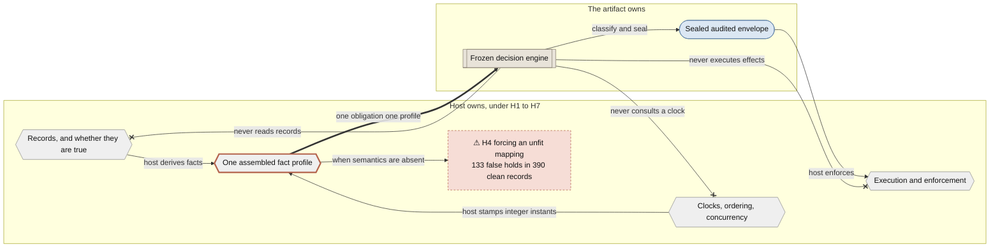

**Reading it.** The payload is the three crossed edges. Everything the engine *does* is one arrow
wide: it reads an account the host wrote down and returns a class. Neither frozen engine file
imports `time`, `datetime`, `random` or `os`, and the only date-time reference in either is a
string-shape regex inside schema validation — so "never consults a clock" is a property of the
bytes, not a policy.

The gap node is the cost of getting the host's half wrong, measured. Forcing a mapping where the
native semantics were absent produced 133 false holds at rate 0.341, and they were not spread out:
all 133 landed in `LIFECYCLE`, which is 133 of that family's 208 clean records, while `REF`, `SCOPE`
and `SUPERSEDE` produced none. The same corpus under a calibrated mapping detects 18 of 18 defects
at zero false holds. H4's instruction to decline rather than force is therefore a measured result,
not a caution.

**Not shown:** the engine does receive integer instants, revocation timestamps and consumption state
— it is blind to *clocks*, not to *time-shaped facts*, and it compares the order of the integers the
host supplied. Also not shown: `decide_audited`, the preflight, the shape of the envelope, and the
four classes. Those are A2, A3, A4 and B2.

**Sources:** `HOST_OBLIGATIONS.md` H1–H7 (H4: *"forcing it produced 133 false holds"*);
`proof/RESULTS.md` (the `b1` arm at false-hold rate 0.341 and the per-family table — clean-n 208 +
9 + 170 + 3 = 390; the `b1_calibrated` arm at 18/18 detection and zero false holds);
`EXAMPLE.md` "Who owns what"; `README.md` opening;
`baseline-run/implementation-output-0.3/b1_capabilities.py` and `pcb_runner.py` import blocks.

---

## A2 — The decision law: frozen precedence and first-match short-circuit

*How does one obligation's fact profile become one of four classes?*

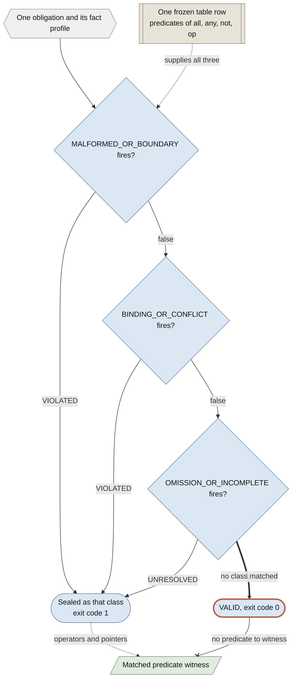

**Reading it.** Two things become structural here that prose has to warn about.

First, **at most one predicate is ever true**, because after a match the loop stops and later classes
are recorded `false` having never been evaluated. That is why the envelope's `first_match_predicates`
carries exactly three keys with at most one `true`, and why it is not the same field as a fixture
entry's identically-named one, where several can be true.

Second, **`VALID` is not a test.** The frozen contract's `class_precedence` is the four-tuple
ending in `VALID`, and the table writes that row's predicate as `{"op": "NO_EARLIER_CLASS_MATCH"}` —
but the running engine never evaluates it. `CLASS_PRECEDENCE` is a *three*-tuple of defect classes
and the return is `matched or "VALID"`. The operator exists in the contract and in the refuted
second implementation, where it is hardcoded to return false; in the shipping engine it is dead
text. A `VALID` therefore carries an empty `matched_class_witness` — there is no fired predicate to
witness.

**Not shown:** each of the three defect predicates is one predicate, not one test — the contract's
language is `all` / `any` / `not` / `op` over frozen atomic operators addressing `decision_input` by
RFC 6901 pointer, so a single box here can be a tree of a dozen operators. Also not shown: the
request pipeline around this (B1), the closures that can overturn a `VALID` after the fact (A3), and
the thirty rows this is one of (the appendix).

**Sources:** `baseline-run/control/B1_PRIMARY_IMPLEMENTER_CONTRACT_0_1.json`
(`semantic_decision_contract.class_precedence`, `predicate_language`, `operation_decision_table`,
`evaluation_result_contract` — `VIOLATED` / `VIOLATED` / `UNRESOLVED` and exit 1 are its literal
values); `baseline-run/implementation-output-0.3/b1_capabilities.py:57` (`CLASS_PRECEDENCE`, the
three-tuple) and `:635` (`return matched or "VALID"`); `grounded-0_4/rr_api.py:209` (`_CLASS_ORDER`),
`_classify_traced`, `_trace`; `second-implementation/rr2.py:1260`
(`if op == "NO_EARLIER_CLASS_MATCH": return False`); `README.md` envelope-key table
(`first_match_predicates` — *"Closed three keys"*, *"At most one is true"*; `matched_class_witness`
— *"Empty when the sealed class is VALID"*).

---

## A3 — Six answers, from two different authorities

*What can come back, and which of these did the law not assign?*

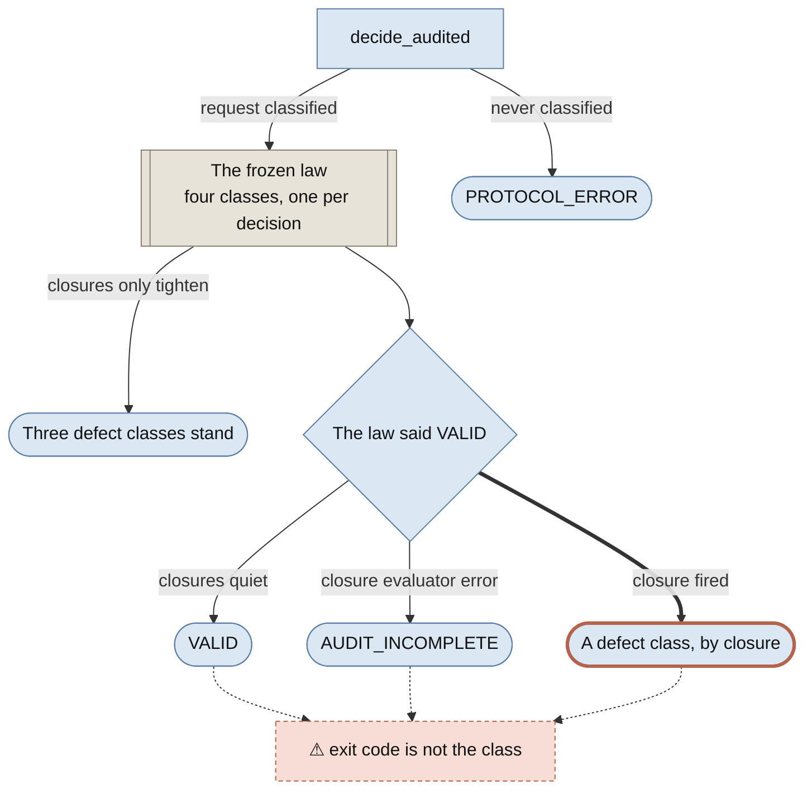

**Reading it.** Six values, two origins. The frozen law assigns exactly four classes;
`AUDIT_INCOMPLETE` and `PROTOCOL_ERROR` are values only the audited *surface* can return, and a
consumer switching on `audited_behavior_class` must handle all six.

The mechanism worth drawing is that **`VALID` is the only class the surface may overwrite.**
Closures tighten and never loosen, so the three defect classes pass through untouched, while a
sealed `VALID` can leave as `VALID`, as `AUDIT_INCOMPLETE` (a closure evaluator errored, so the
surface refuses to certify what it could not completely check), or as a defect class (a closure
fired).

The dashed caveat is the trap, and it is a documented design property rather than a defect:
`exit_code` is *the frozen engine's* status, is assigned once from the sealed response, and is never
revisited — so all three of those outcomes report `0`. `README.md` states it in bold: the audited
class is not derivable from the exit code. Reproduced by inverting `compatibility_verdicts` on the
`OBL-30-IO` fixture, which returns `audited_behavior_class: BINDING_OR_CONFLICT` with
`exit_code: 0` and a sealed response still reading `VALID`.

**Not shown:** this is not a state machine — nothing transitions between these values. It is an
origin map, and a single decision produces exactly one of the six. Also not shown: the digests, the
witness and the seal inside the envelope (B2), and `object_request_error` / `transport_error`, which
are refusal detail rather than class values (B1).

**Sources:** `TRUST_MODEL.md` (*"the audited envelope is not four-valued"*); `README.md`
§"Exit codes" (*"**The audited class is not derivable from the exit code:** a closure that tightens
`VALID` to a defect leaves `exit_code` at `0`, because the sealed response is preserved verbatim"*)
and the envelope-key table (`audited_behavior_class`, closed six-value set);
`grounded-0_4/rr_api.py` `decide_audited` (`exit_code` assigned once at the envelope build; the
`AUDIT_INCOMPLETE` and tightening resolution immediately after); `ERRATA.md` E9;
`grounded-0_4/test_grounded_0_4.py` section 4 and
`supplemental-0_3/fixtures/B1_SUPPLEMENTAL_SEMANTIC_FIXTURE_PACK_0_3.json` for the probe fixture.

---

## A4 — The preflight, and the calibration cliff

*Will the preflight say anything useful about my records?*

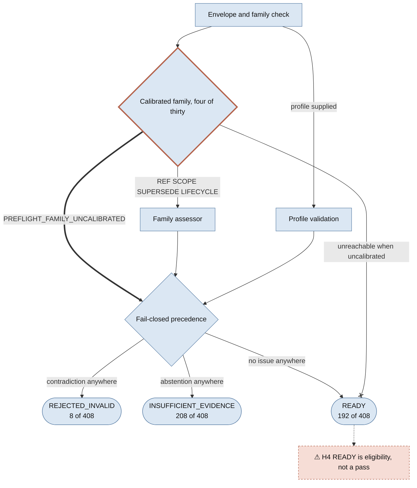

**Reading it.** Two mechanisms the three-row status table hides.

**The cliff.** `FAMILY_OBLIGATION` maps exactly four families to obligations — `REF`→`OBL-02`,
`SCOPE`→`OBL-03`, `SUPERSEDE`→`OBL-15`, `LIFECYCLE`→`OBL-17` — and `_ASSESSORS` has the same four
keys. Anything else gets `PREFLIGHT_FAMILY_UNCALIBRATED`, the family assessor never runs, and
`READY` becomes structurally unreachable. That is a cliff, not a gradient, and it is the real
adoption constraint on this artifact.

**The resolver.** Status is *not* decided by an early-exit chain. Every control layer that can run
does run, issues accumulate across layers, and a fail-closed resolver picks
`REJECTED_INVALID` > `INSUFFICIENT_EVIDENCE` > `READY` at the end over the accumulated statuses —
which is why `issues` may mix layers and why an issue code does not determine the status. The
consequence the parallel drawing makes obvious, and which reading the three-row table does not: an
uncalibrated family carrying a malformed fact profile returns `REJECTED_INVALID` with **both**
`PREFLIGHT_FAMILY_UNCALIBRATED` and `PREFLIGHT_PROFILE_SHAPE_INVALID` in `issues`, because profile
validation is a different layer and the resolver takes the strictest. Uncalibrated on its own
returns `INSUFFICIENT_EVIDENCE`. Both reproduced live.

**Not shown:** seven structural refusals in `_check_record` short-circuit everything above — a
non-dict record, a JSON-domain violation (walked twice), caller-supplied extra fields, a malformed
`record_id`, a non-string `family`, a non-object `native` or `observations`, or a malformed
`state_revision`. Each returns `REJECTED_INVALID` before profile validation runs, so those are the
one place the accumulate-then-resolve design does not apply. Also not shown: the per-family
assessors' internal rules, the JSONL CLI, and the engine on the far side — `READY` does not invoke
it and does not authorize invoking it.

**Sources:** `adapters/portable_preflight.py` module docstring, `FAMILY_OBLIGATION`, `_ASSESSORS`,
`_check_record`, `preflight` (the resolver folds accumulated layer statuses at the end);
`adapters/README.md` (*"On the raw-SHA-pinned all-408 corpus, native structure alone yields 192
`READY`, 8 `REJECTED_INVALID`, and 208 `INSUFFICIENT_EVIDENCE`"*); `TRUST_MODEL.md` (`READY` is
eligibility, never a pass); `HOST_OBLIGATIONS.md` H4; `ERRATA.md` E7.

---

## B1 — One request, end to end, and the three places it can stop

*What happens to my bytes, and where does it stop early?*

This is the **overview**; A2 is its detail. B1 does not restate the precedence chain and A2 does not
restate the pipeline.

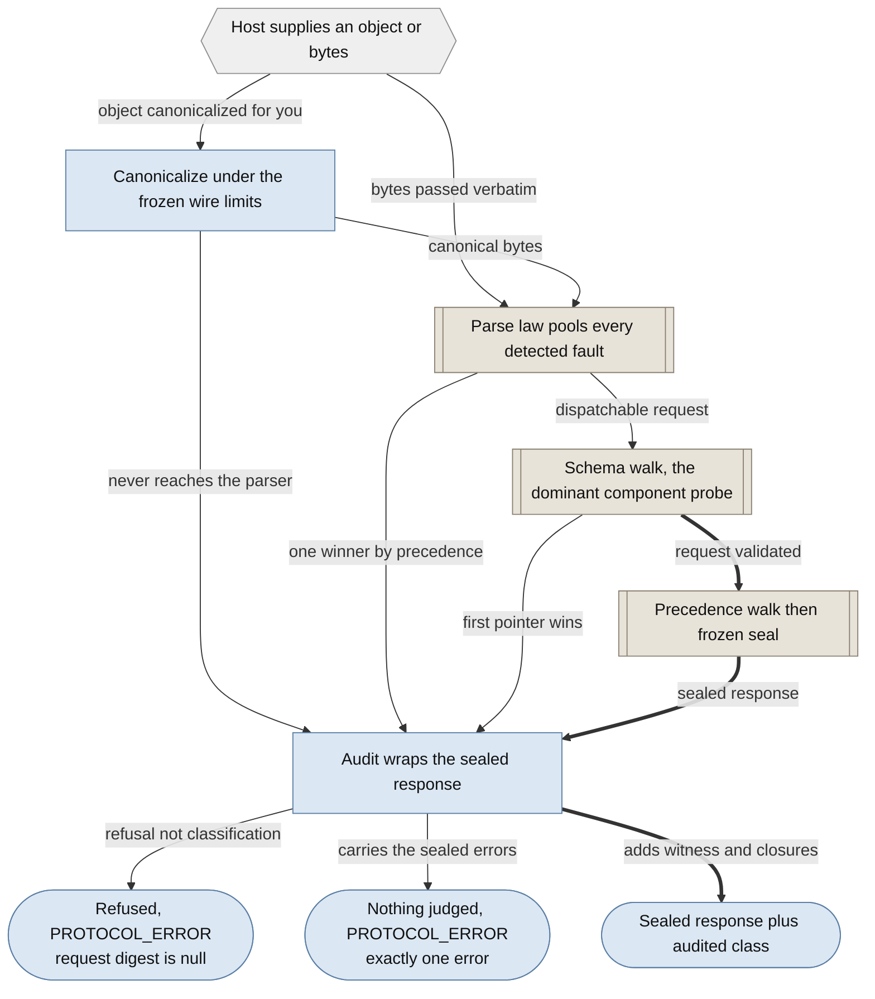

**Reading it.** `decide_audited` has three distinct terminations, and they leave the pipeline at
different depths. That is why **the absence of an audit key is meaningful**: an object that could
not be canonicalized never produced request bytes, so `request_raw_sha256` is null; a protocol error
never reached classification, so `decision_input_sha256` is null and `first_match_predicates` is
absent entirely; only the third route carries a witness. A list of the three outcomes cannot show
that, because the information is *where* each one exits.

The parse law and the schema walk are drawn as two nodes rather than one because they behave
differently. The parse law pools every detected fault and returns exactly one error by frozen
precedence (`ERR_EMPTY_INPUT` 10 through `ERR_INTERNAL` 100). The schema pool is reached only for a
`core` or `wrapper` `format_version`, and returns the first failing pointer by UTF-8 order.
Deliberately, `ERR_SCHEMA` at precedence 80 is resolved *before* `ERR_LIMIT` at 90.

On cost, the committed measurements support an ordering claim and not a percentage. The schema walk
is by far the largest component probe; classify and the seal primitive are two orders of magnitude
smaller. The audit layer itself is not where the time goes — `decide_audited()` costs 1.033x
`decide()` at the paired-ratio median.

**Not shown:** the preflight in `adapters/` is **not** on this path — `decide_audited` never calls
it, it never builds an engine request, and `rr_api.py` contains no reference to it. It is an
out-of-band host-side gate (A4), and drawing it here would be wrong. Also hidden inside the single
`engine` node: the frozen precedence walk that A2 draws, and two stops that must never fire —
`ERR_INTERNAL` when a built response fails its own response schema, and `ERR_LIMIT` when the
response exceeds `MAX_OUTPUT_BYTES` (16777216).

**Sources:** `grounded-0_4/rr_api.py:649` (`decide_audited`), `:347` (`_prepare_request`), `:242`
(`_bounded_object_wire` — refuses with `ERR_JSON`, `ERR_LIMIT` or `ERR_NUMBER` and returns
`raw = None`, which is why `request_raw_sha256` is null on that route);
`baseline-run/implementation-output-0.3/pcb_runner.py:226` (`_parse`), `:333` (`_execute`), `:361`
(`_dispatch`), `:301` (`_core_schema_error_pool`);
`baseline-run/implementation-output-0.3/b1_capabilities.py:44` (`ERRORS`, the precedence-ordered
registry, one error object per response), `:616` (`classify`), `:1011` (`_semantic_output`), `:1031`
(`build_core_response`); `README.md` "What you get back" and the `audit`-key table.
Cost figures from `perf/PROFILE_BASELINE.md` §"Direct valid-path components": schema walk 6.345278
ms, classify 0.026111 ms, seal primitive 0.029320 ms, against a whole in-process `decide()` median
of 5.119398 ms — **that document states the component probes are deliberately non-additive and must
not be summed into end-to-end latency**, which is why the component exceeds the total and why no
percentage is quoted here. Same file for the 1.033x paired ratio.

---

## B2 — What the envelope binds, and the one thing it does not

*Holding an envelope, what can I recompute, and what am I still trusting?*

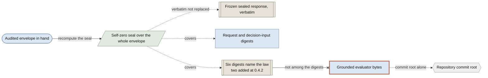

**Reading it.** The envelope is a custody structure, and its interesting property is a hole. The
self-zero seal covers `format_version`, `sealed_response`, `exit_code`, the whole `audit` object and
`audited_behavior_class`, with `audit_sha256` itself zeroed — so almost everything about the
decision is recomputable from the envelope alone.

**What 0.4.2 fixed, and why it mattered.** Until it landed, `governing_authorities` sealed the
closure policy, the authority register and the two engine *source* files — but not the contract
holding the rows and predicate atoms the engine actually executes. Two parties running different
decision tables therefore emitted byte-identical `governing_authorities`, and a recipient holding an
envelope could not tell which law decided it. That was provable by construction rather than by
attack: the four digests were computed from four files, none of which was a contract, so changing
the table could not change the seal. A *local* tamper was always caught, because both contracts are
engine-manifest rows and importing the package verifies them; the gap was cross-party
identification, which is the entire purpose of an audit envelope.

**The hole that remains, stated more sharply than the scope note does.** `TRUST_MODEL.md` and
`ERRATA.md` E8 both say evaluator bytes are not among the sealed digests. The stronger true
statement is that *every runtime pin the engine relies on is a byte-length-plus-SHA literal inside
`grounded-0_4/rr_api.py`'s own source* — the closure policy, the authority register, both contracts,
`authority_surface.py`, `b1_capabilities.py` and `pcb_runner.py`. So `rr_api.py` is the root of the
pin chain, and it is precisely the one file whose digest never enters the envelope.
`receiver_reliance/engine_manifest.json` does pin it and `import receiver_reliance` verifies it, but
that manifest is an in-repo file rather than a field of the envelope, so an envelope holder cannot
reach it. The unsealed file is the one that decides what all the sealed digests are.

**The drift this diagram found, now closed.** When this page was first assembled, the code
emitted `B1-AUDITED-DECISION-0.4.2` with six keys while every document describing it still
described 0.4.1: `README.md` said "Closed four keys" and named `0.4.1`; `TRUST_MODEL.md` and
`ERRATA.md` named `0.4.1`; `ADOPTION.md` A7 said "four governing authorities pinned";
`rr_api.py`'s own module docstring described the 0.4.1 format; and `ERRATA.md` had no entry for
the defect 0.4.2 fixed. All of it is closed (`5c29965`, `69853aa`, `5073238`): E18 records the
defect, E8 points forward to it, the live-voice documents now say 0.4.2 and six keys, and the two
dated observations (A7's reproduction, A1's publication record) carried currency parentheticals
rather than rewrites; their records now live in [ADOPTION_HISTORY.md](ADOPTION_HISTORY.md) A7 and A1. The finding is kept because it is this repository's characteristic failure
shape — found again by the act of drawing the seal.

**Not shown:** the key-by-key inventory of `audit` — which keys appear on which route is the
mechanism B1 draws as three differently shaped terminations, and `README.md` already carries it as a
table. Also not shown: everything the seal cannot speak to at all — who ran the decision, when, and
whether the host's attested facts were true (H1).

**Sources:** `grounded-0_4/rr_api.py:174` (`AUDIT_FORMAT`), `:180-199` (the comment block explaining
the cross-party identification gap), `:200-207` (`GOVERNING_AUTHORITIES`, six keys:
`closure_policy_sha256`, `authority_register_sha256`, `engine_capabilities_sha256`,
`engine_runner_sha256`, `decision_table_contract_sha256`, `composed_contract_sha256`), `:122-166`
(the byte-length and SHA-256 literals for every pinned runtime input), `:649-714` (`decide_audited`,
the seal call); `baseline-run/implementation-output-0.3/b1_capabilities.py:102`
(`self_zero_sha256`); `receiver_reliance/engine_manifest.json` (eleven files, self-zero sealed);
`ERRATA.md` E8 *Scope (2026-08-13)*; `TRUST_MODEL.md:30` (the audited-decision evidence row).
Envelope shape reproduced by running `decide_audited` on `examples/handoff-clean.json`: top-level
keys `format_version`, `sealed_response`, `exit_code`, `audit`, `audited_behavior_class`,
`audit_sha256`; six `governing_authorities` keys; three `first_match_predicates` keys.

---

## C1 — One trust root, and everything that hangs off it

*What does a green check in this repository actually buy me?*

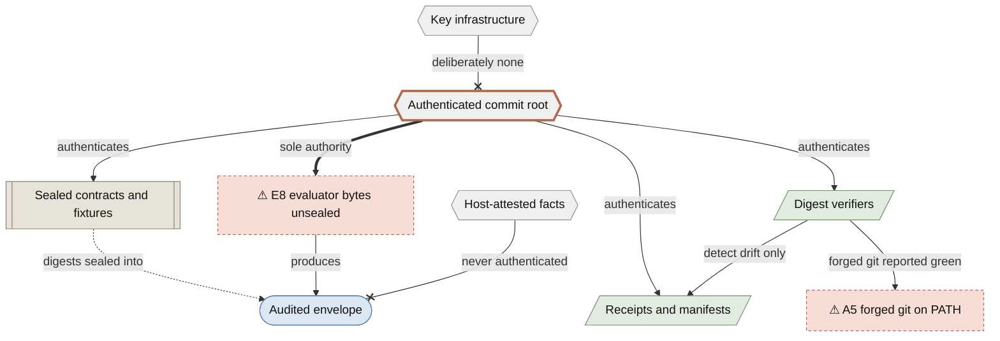

**Reading it.** `TRUST_MODEL.md` is a page of tables asserting, per evidence class, a "proves" and a
"does not prove". The mechanism behind all of them is one sentence: everything is content-addressed
relative to the authenticated commit, nothing is signed, so a party who can rewrite the repository
can rewrite any in-repo pin along with it. Drawn as one root with every evidence class descending
from it and **no** inbound signature edge, the shared dependency is immediate — which is the thing
the per-row tables structurally hide.

The A5 edge is the demonstration, not a hypothesis. A forged `git` placed earlier on `PATH` made
`verify_hygiene` report `HYGIENE_PASS` at custody 17/17 while a planted modification was still on
disk, and made a receipt gate report `PASS` against a forged HEAD. `shutil.which` resolved to the
same forgery, so it was never a defence. `portability/pinned_tools.py` moves the trust root from
`PATH` to an administrator-write-only directory; that narrows the boundary and does not close it,
because `subprocess` cannot launch from an already-verified handle on either platform. A receipt is
not evidence that the host producing it was sound.

**Not shown:** the per-evidence-class "proves / does not prove" rows. `TRUST_MODEL.md` carries those
as a table and a table is the right form for them; this draws only the dependency every one of those
rows shares. Nor is any *remote* authentication drawn — how a consumer establishes that the commit
they hold is the published one is outside the artifact by construction.

**Sources:** `TRUST_MODEL.md` §"The trust root" (*"there is no key infrastructure, deliberately"*),
§"What each evidence class proves" (the audited-decision row placing evaluator bytes outside the
sealed digests under E8 scope, and naming H1 for host-attested facts), and §"Trust boundaries, by
surface" (the Harness/tooling row, which records the forged-`git` demonstration verbatim);
`ADOPTION.md` A5, status **closed** — eight of eight harnesses migrated, the `RR_TOOL_DIR`-unset
ambient-`PATH` residual still disclosed, which is the edge drawn here; `HOST_OBLIGATIONS.md` H1;
`grounded-0_4/rr_api.py:174` and `:200-207`.

---

## C2 — The repository by class, and the ERRATA loop

*Which bytes may I change, and what happens when a defect lands in bytes that may not?*

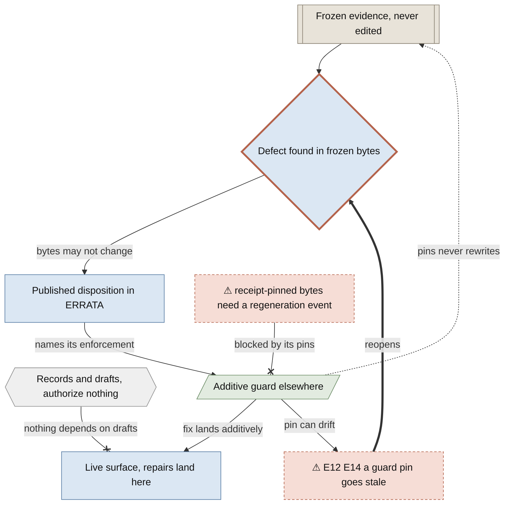

**Reading it.** The README's directory table is a table and stays one. What is not a table, and what
is this repository's most distinctive discipline, is the **loop**: a defect found in frozen evidence
cannot be fixed by editing the bytes, so it becomes an ERRATA disposition plus an additive guard
somewhere else — which is itself checkable, which can itself go stale, which reopens the loop. That
is a cycle, and cycles are precisely what prose renders badly.

The twenty tracked top-level directories, by the class `README.md` assigns each:

| Class | Shape | Directories |
|---|---|---|
| Live surface | `[rectangle]` | `receiver_reliance/`, `grounded-0_4/`, `adapters/`, `portable/`, `examples/`, `deployment/` (off by default) |
| Frozen evidence | `[[subroutine]]` | `baseline-run/` (also harness), `supplemental-0_3/`, `second-implementation/`, `access/`, `evidence/` |
| Harness | `[/parallelogram/]` | `portability/`, `perf/`, `proof/`, `law/`, `replay-corpus/`, `fuzz/`, `.github/` |
| Records | `{{hexagon}}` | `orchestration/` |
| Drafts | `{{hexagon}}` | `continuation-specs/` |

**Not shown:** what is inside each directory. `README.md` has that as a one-row-per-directory table
and it is better than any drawing of it. Also not shown: that `baseline-run/` is simultaneously
frozen evidence and harness, which is why it appears once above with a parenthesis rather than twice.

**Sources:** `README.md` §"Repository map" — the class definitions (*"**Harness** is verification
machinery that produces or checks receipts. **Records** are the process history that claims
elsewhere cite"*) and the per-directory rows, including `continuation-specs/`: *"Not adopted, not
implemented, not evidence"*. `ERRATA.md` preamble (*"Sealed 0.2/0.3 bytes are never edited: fixes
land additively"*; *"Each erratum names its enforcement so the class cannot recur silently"*), E12 (a
published source pin that stopped describing the bytes it names, deliberately not refreshed — *"A
stale pin with a disposition is honest; a refreshed pin is a false provenance claim"*), E14 (the
`SOURCE_PIN_ERRATA` table in `perf/sidecar/verify_receipts.py`, which declared seven stale
receipt-source pairs while they stood and holds none at this tip: the 2026-08-19 regeneration
recorded fresh receipts at the moved bytes instead of spending rows on them, so the mechanism is
unspent rather than retired — an empty table and a live one are the same guard). `ADOPTION.md` A5
with its record in `ADOPTION_HISTORY.md` A5,
status **closed** — `perf/sidecar/_evidence.py` is migrated, and how it was unblocked is what the
gap node above draws: admitted `perf/receipts/robustness/*` receipts and the 61-file portable
manifest pin that file, so the repair had to be re-recorded rather than edited in place. Directory
list recomputed from `git ls-files` at `v1.2.1-31-gf09da5a`.

---

## C3 — What has been pointed at this engine, and the shape of the hole

*What is independently checked, and what is checked only by the reference against itself?*

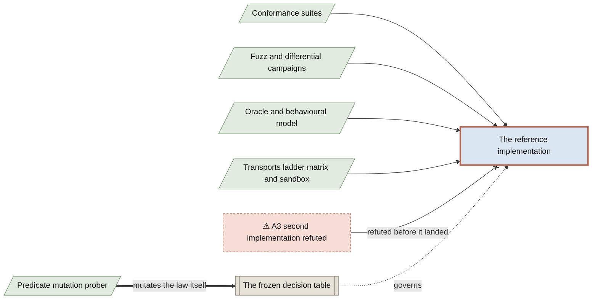

**Reading it.** Listed, the apparatus reads as overwhelming. The honest structure is that almost all
of it attacks the **same implementation**, and the one lane that would have made byte-parity mean
something — a conforming second implementation — was refuted. Attempt 4 fell to `RI5.md` over 592
confirmed divergences across five independent mechanisms. Until one exists, byte-parity is a
property of the reference implementation against itself. A list cannot show that; a broken arrow can.

Behind each lane node: **conformance** is 800 checks on the accepted 0.2 surface, and a composed run
reporting 907 — of which those same 800 are re-run under the 30-operation interface, plus 107
supplemental. The two counts are nested, not additive. **Campaigns** is the 100,000-identity seeded
aggregate (67,599 unique raw byte strings, zero findings) plus the coverage-guided differential
campaign that refuted a candidate at identity 588. **Oracle** is the independent no-read oracle and
the finite behavioural model. **Portability** is the remaining three lanes plus the hosted matrix:
CPython 3.12/3.13/3.14 across Ubuntu x64/arm64, macOS arm64 and Windows x64/arm64, with a hardened
container sandbox.

The focal edge is the one genuinely different direction of attack. Every other program establishes
that an implementation matches the contract's bytes; the predicate mutation prober asks, per
predicate atom, whether breaking that atom makes any fixture notice. A surviving atom is either a
fixture gap (the predicate is real and nothing tests it) or a table gap (the predicate is inert). It
stages every mutation into a temporary directory and never touches frozen bytes. **It is tracked at
`HEAD`, cited by no document, and run by no workflow** — see C5 for why that matters.

**Not shown:** the check counts, deliberately kept out of the labels — a lane's authority is what it
executes against, not how many assertions it makes, and putting the numbers in the boxes invites
reading the picture as a scoreboard. Also not shown as separate lanes: `portability/` publishes
five, and the deterministic live-transport schedules, the bounded concurrency ladder and the hosted
matrix are folded into one node here because they attack the same target through the same arrow.
And not shown at all: the adversarial review rounds and the seven fresh-context refutation rounds,
which are chronology rather than structure and live in `orchestration/`.

**Sources:** `README.md` §"Cross-platform validation" (the five portability lanes, enumerated) and
§"Contributing / re-verification" (the 100,000-identity aggregate across `fuzz/fuzz.py` and
`perf/batch_campaign.py`; the coverage-guided campaign refuting at identity 588 —
`second-implementation/findings/F-WP4-007.md`; *"a conforming second implementation still does not
exist and remains the single most valuable outside contribution"*), and §"Quickstart" (the 800-check
breakdown, and the composed run's two summary lines `800 … failures=0` and `107 … failures=0`
totalling 907). `ADOPTION.md` A3, status **Open — no attempt scheduled**.
`.github/workflows/conformance.yml` (the 800 and 907 counts, in the step names). `ERRATA.md` E10.
`baseline-run/verify_predicate_coverage.py` module docstring (the two arms, the temporary-directory
staging, and *"which parts of the law the published evidence actually constrains, which is the
denominator the artifact has never published"*); its absence from every other tracked file confirmed
with `git grep`.

---

## C4 — The evidence chain: what pins what, and which verifier recomputes

*Holding a green verifier line, what did that verifier actually check?*

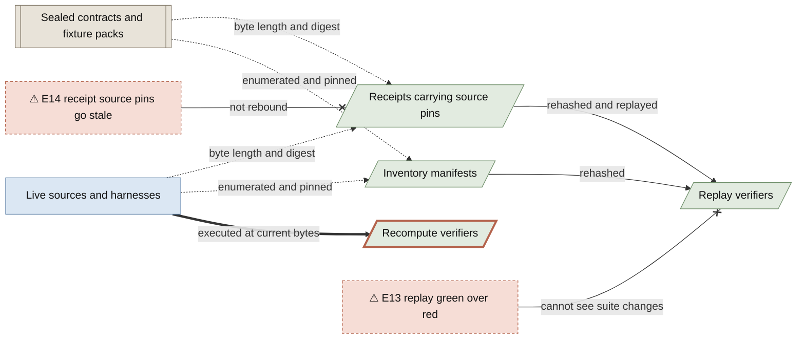

**Reading it.** Two green lines can look identical and mean completely different things. A replay
verifier establishes that committed receipt bytes are intact, that the sources they name still hash
as recorded, and that recorded transcripts still satisfy the validators of their own era — without
executing anything. A recompute verifier executes the artifact at the bytes you have checked out and
holds its live output against the declarations. `portability/verify_live.py` states the distinction
in its own first line, and E13 is what happens when a reader conflates them: `verify_receipts`
reported `checks=193 failures=0` truthfully while the live gate was red for four commits, because
the recorded stdout it replays says `Ran 7 tests`.

**Which program is which**

| Class | Programs | What a green line means |
|---|---|---|
| **Replay** | `portability/verify_receipts.py` (`checks=300`), `perf/sidecar/verify_receipts.py` (`checks=134`), `second-implementation/verify_artifacts.py` | The committed receipt bytes are intact, the sources they name still hash as recorded, and the transcripts they recorded still satisfy the validators of their own era. **Nothing was executed.** |
| **Recompute** | `portability/verify_live.py` (`gates=20`), `baseline-run/verify_conformance_authority.py` (`checks=32`, four declared divergences), `portability/test_home_path_disclosure.py`, `receiver_reliance/generate_engine_manifest.py --check` plus the package's import-time check over eleven engine files, `portable/gate.py` | The artifact at the bytes you have checked out was executed, and its live output was held against the declarations. |
| **Pin surfaces** | `portable/MANIFEST.json` (61 files — 22 runtime, 13 gate, 11 authority, 9 document, 5 receipt, 1 version), `receiver_reliance/engine_manifest.json` (11 files, self-zero sealed), each receipt's `source_sha256` map | Inventory bindings. They detect drift; they do not authenticate — see C1. |

`perf/sidecar/verify_receipts.py` was red on purpose between the F-WP5-006
supervision repairs and the 2026-08-19 regeneration event — seven checks,
enumerated in `perf/SIDECAR.md` while they stood. The event recorded fresh
receipts at the repaired bytes and rebound `ADMITTED`, the inventory and the
manifest; ADOPTION A5/A6 carry the closure.

`portable/gate.py` is the row worth a second look, because it sits on the recompute side for a
reason and still does not close E13's shape. It runs eight suites as subprocesses at current bytes —
the bundle manifest check, the bundle and CLI tests, the portable preflight suite, the
second-implementation cross gate and bounded preflight, and the sidecar suite and receipt verifier —
and validates each live summary line. But its validators are deliberately count-agnostic
(`tests=([1-9][0-9]*) failures=0`), so it executes at current bytes while pinning no declared count.
That is why it can never go stale the way E13 went stale, and also why it cannot catch a stale
declaration.

**Not shown:** the audited envelope's own digest set — request digest, decision-input digest, six
governing-authority digests, self-zero seal. That is a different custody structure (one decision's
bindings, not the repository's) and belongs to B2. Also not shown: that twenty-seven of the
thirty-nine frozen files in E15's census are pinned only by a digest table inside another *tracked
document* that no program reads — a prose pin detects nothing on its own. It is one node too many
here, and `ERRATA.md` E15 states it plainly.

**Sources:** `portability/verify_live.py` module docstring, the primary source for this diagram:
*"Recompute what the receipts assert, instead of replaying what they recorded"*.
`portability/verify_receipts.py` and `perf/sidecar/verify_receipts.py` docstrings (neither file
contains a `subprocess` reference). `portable/gate.py` `COMMANDS` (eight entries), `main()` and
`_summary()`. `ERRATA.md` E13, E14 (`SOURCE_PIN_ERRATA`, which declared seven stale receipt-source
pairs while they stood and declares none at this tip — the 2026-08-19 regeneration re-recorded the
receipts at the moved bytes rather than spending rows), E15
(52 declared instances, 39 frozen and 13 recorded, of which 27 are pinned only in prose), E16.
`README.md` §"Cross-platform validation": `verify-live: gates=20 passed=20
declared_era_divergences=12 undeclared_divergences=0 failures=0`; `verify-receipts: checks=300
failures=0`; `conformance-authority: checks=32 failures=0 declared_divergences=4`.
`portable/MANIFEST.json` (61 rows, `role` field) and `portable/build_manifest.py` (derived from
`portable/inventory.json`, not from a tree walk). `receiver_reliance/engine_manifest.json`
(`file_count: 11`).

---

## C5 — The verification surface: which lane runs which gate

*Which gate fires without a person, and which does not?*

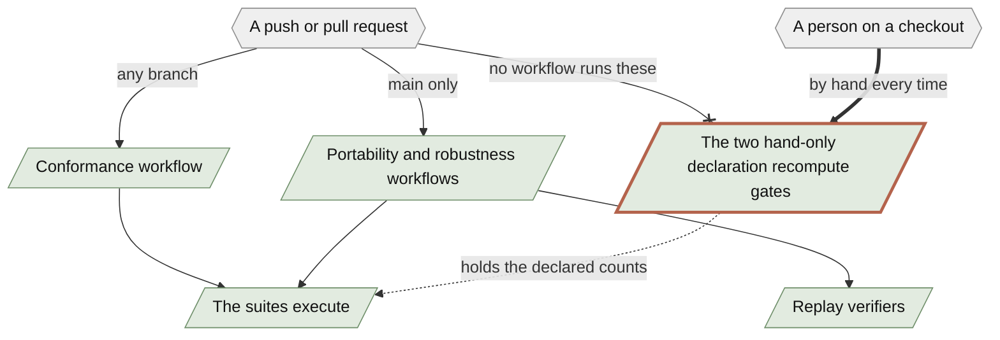

**Reading it.** The suites themselves recompute in CI, and generously — `conformance.yml` runs both
runners on every push and every pull request across three operating systems, and the robustness
workflow executes ten `grounded-0_4` steps plus fifteen more across the other trees. The distinction
this draws is narrower, and until the consumer-surface sweep it was the whole point: **most programs
that check a *declaration about* those suites against current bytes fired only when a person ran
them.** The sweep closed most of that gap by route rather than by workflow edit.
`verify_conformance_authority`, `test_home_path_disclosure`, `test_audit_seal`,
`generate_engine_manifest` and `test_engine_manifest` are now rows of
`portability/matrix/plan.json` `profiles.portability_checks`, which the portability workflow
executes on every normative cell through `receipt.py run`. They still appear in none of the three
workflow files — verified by grep, not inferred — because the plan, not the workflow, is the
command manifest, which is why that grep alone never established hand-only status.

Two are deliberately still hand-only, and the reasons are measured rather than habitual.
`verify_live` — the one the README tells a third party to run first — executes all twenty charter
gates, two of which are wall-clock assertions (`test_batch.py --perf` requires an amortized ratio at
most 3x, and the single-pass benchmark measures one), and `plan.json` deliberately confines those to
the single `expanded_gate` row rather than to every public-preview arm runner.
`verify_predicate_coverage.py --full` mutates 117 predicate atoms through two arms each, re-running
the 0.2 conformance suite every time; measured at roughly 26 seconds per atom, that is about 51
minutes on one cell, and the matrix README already states the policy for exactly this shape — one
long finite enumeration is not turned into fifteen redundant jobs.

That is exactly E13's failure shape: a declared count went stale while the suite it named was
green. **It was live in the working tree when this page was assembled.** Sealing the decision
table at 0.4.2 added four mutation arms to the grounded regression, taking it from 517 checks to
521. The programs moved with it — `portability/sandbox/expanded_gate.py` says `checks_521`,
`portability/matrix/test_receipt.py` asserts 521, and `portability/verify_receipts.py` records the
transition in a comment — but the prose did not: `README.md` still called it "the 517-check
regression" in two places and still said "the current suites have 517, 9 and 9", and `ADOPTION.md`
A1 still said "the 517-check grounded regression". No hosted workflow caught it, because the gate
that compares declarations to live counts is not wired into one; it was found by assembling this
page and closed by hand (`5c29965`..`000652d`).

**Which command proves which claim**

| Command | Proves | Lane |
|---|---|---|
| `python -B baseline-run/implementation-output-0.2/run_conformance_0_2.py` | The accepted 0.2 surface reproduces 800 pinned checks | **CI** — every push and PR, three OSes |
| `python -B baseline-run/implementation-output-0.3/run_conformance_0_3.py --suite all` | The composed 0.2 + 0.3 surface reproduces 907 checks | **CI** — every push and PR, three OSes |
| `python -B grounded-0_4/test_grounded_0_4.py` and nine sibling steps | The audited decision layer holds its regressions, its lint gate, and its authority-table drift check | **CI** — `main` only |
| `python -B adapters/test_portable_preflight.py` and four sibling checks | The three-state preflight and its outcome receipt reproduce | **CI** — `main` only |
| `python -B portability/verify_receipts.py` | The committed receipt spine is intact and replays | **CI** — `main` only |
| `python -B perf/sidecar/verify_receipts.py` | Both admitted WP5 receipts, their raw pins, seals, and the E14 dispositions | **CI** — `main` only |
| `python -B portability/verify_hygiene.py` | Branch hygiene with custody-bound exceptions — **this is the program the forged `git` defeated** | **CI** — `main` only |
| `python -B second-implementation/verify_artifacts.py` | WP4 receipt bindings, import closure, runtime read set | **CI** — `main` only |
| `python -B portable/gate.py` | Eight suites execute at current bytes, under count-agnostic validators | **CI** — `main` only |
| `python -B portability/verify_live.py` | **The twenty charter gates pass at the bytes you have checked out** — the README tells a third party to run this one first | **hand only** |
| `python -B baseline-run/verify_conformance_authority.py` | The frozen manifests' literal `PASS` and `failures: 0` equal what the suites actually observe (E16) | **CI** — every normative matrix cell |
| `python -B portability/test_home_path_disclosure.py` | E15's fifty-two-instance disclosure still describes current bytes | **CI** — every normative matrix cell |
| `python -B receiver_reliance/generate_engine_manifest.py --check`, `test_engine_manifest.py`, `test_audit_seal.py` | The eleven engine files still hold their published bytes | **CI** — every normative matrix cell |
| `python -B baseline-run/verify_predicate_coverage.py --full` | Which predicate atoms of the frozen law any fixture actually constrains | **hand only**; this page is its first documentary reference |

**Not shown:** the three `workflow_dispatch` triggers, which still require a person and so belong to
the right-hand lane in spirit. Also not shown: `ADOPTION.md` A2 is **closed** — the robustness
trigger was retargeted to `main` on 2026-08-18 (ratified by the release), and the first green
hosted runs are recorded (32225089695 at `e27e331`, 32270122137 at `69853aa`) — green for the
first time, because ERRATA E17's ambient-variable validator had failed every cell until it was
fixed.

**Sources:** `.github/workflows/conformance.yml` (`on: push` and `pull_request`, unrestricted, plus
`workflow_dispatch`), `portability.yml` and `robustness-verification.yml` (`on: push` restricted to
`branches: [main]`, plus `workflow_dispatch`), and every `run: python -B …` step enumerated — the
robustness workflow's `suites` job runs ten `grounded-0_4` steps, five `adapters/` steps, three
`second-implementation/` steps, two `perf/sidecar/` steps, `portable/gate.py`,
`portability/verify_receipts.py` and `portability/verify_hygiene.py`. The absences were verified
mechanically: `grep -c` for `verify_live`, `verify_conformance_authority`,
`test_home_path_disclosure`, `test_audit_seal`, `engine_manifest` and `generate_engine_manifest`
returns `0` in all three workflow files — which is why that grep is not by itself evidence of
hand-only status, and `portability/matrix/plan.json` `profiles.portability_checks` has to be read
beside it. `README.md` §"Cross-platform validation" (*"**Run this one
first.**"*, and the era-divergence declaration, now `521, 9 and 9`), §"Repository map" (the
`521-check regression` row),
§"Contributing / re-verification" (the hand-run list). `ADOPTION.md` A1 with its record in
`ADOPTION_HISTORY.md` A1 (a dated publication
record, now carrying a 521 currency parenthetical) and A2 (**closed**; hosted runs 32225089695 and
32270122137 on `main`). `ERRATA.md` E13, E15, E16. The live count 521 is what
`grounded-0_4/test_grounded_0_4.py` prints at `HEAD`; the machinery agreeing with it is
`portability/sandbox/expanded_gate.py` (`checks_521`), `portability/matrix/test_receipt.py` and the
comment block above `LEGACY_GATE_VALIDATORS` in `portability/verify_receipts.py`.

---

## Appendix — the thirty operations, in the contract's own words

**This is a table on purpose.** Thirty rows with no dependencies between them is a list, and a
diagram of a list is thirty identical boxes — the failure mode, not the deliverable. So: a table,
with the obligation text copied byte-exact from `functional_obligation`, no paraphrase and no
invented family names.

The only grouping the repository itself supplies is the generation split, and it is the one that
matters for what you can rely on: **28 accepted core rows** (the frozen 0.2 engine) plus **2
supplemental rows** (0.3), composed into the 30-operation surface. The second column marks the four
rows the portable preflight has a calibration rule for — A4's cliff, on named rows.

### The 28-operation accepted core (`B1`, generation 0.2)

| Obligation | Preflight family | Functional obligation, verbatim |
|---|---|---|
| `OBL-01` |  | Pin shared, versioned vocabulary for records, edges, purpose, scope, context, use, lifecycle, and decisions. |
| `OBL-02` | `REF` | Give every record and material revision exact immutable identity; exact references never mean latest. |
| `OBL-03` | `SCOPE` | Represent declarations of adoption/intended use with generic records and context/use/transition edges. |
| `OBL-04` |  | Record origin, custody, transformation, agents, activities, and derivation separately from truth or authority. |
| `OBL-05` |  | Bind each exact proposition version to declared evidence items, spans, inference steps, and source versions. |
| `OBL-06` |  | Evaluate relevance, credibility, convergence, redundancy, dependence, attack/defense, burden, standard, and unresolved status. |
| `OBL-07` |  | Keep evidentiary support and use-specific action authorization as distinct records, edges, and results. |
| `OBL-08` |  | Define an exact action manifest over actor, capability, target, effect, inputs, resources, purpose, scope, externality, assumptions, and policy. |
| `OBL-09` |  | Evaluate permissions, prohibitions, duties, constraints, conditions, continuity, attributes, burdens, and conflicts under one policy version. |
| `OBL-10` |  | Enforce least authority and block independent-principal elevation across principal, class, capability, target, effect, subject, purpose, and scope. |
| `OBL-11` |  | Close and isolate each action's declared support, authority, policy, and influencing-resource basis. |
| `OBL-12` |  | Parameterize information flows by sender, recipient, subject, information type, transmission principle, context, purpose, and scope. |
| `OBL-13` |  | Stage memory changes and commit them transactionally with validation and atomic visibility. |
| `OBL-14` |  | Require declared parent and dependency closure for records, inferences, policies, actions, corrections, and handoff obligations. |
| `OBL-15` | `SUPERSEDE` | Apply exact-version correction, invalidation, and typed cascading repair while preserving independent valid paths. |
| `OBL-16` |  | Package versioned role-aware handoffs with exact artifacts, intended use, support/provenance, authority, obligations, assumptions, missing evidence, and decision ownership. |
| `OBL-17` | `LIFECYCLE` | Track public commitments, duties, acknowledgement, discharge, expiry, violation, continuity, and closure as event-only lifecycle transitions. |
| `OBL-18` |  | Return unresolved/not-adjudicable whenever required authority, provenance, closure, dependency, standard, or world fact is absent or unknowable. |
| `OBL-19` |  | Emit tamper-evident receipts for evidence evaluation, authorization, gate decisions, workflow state, invocation, and observed effects. |
| `OBL-20` |  | Mediate protected effects with a deterministic pre-effect gate that binds exact fields, effect, invocation authority, policy, and observed effect. |
| `OBL-21` |  | Version and replay consumer expectations through one common matching suite. |
| `OBL-22` |  | Treat retrieved content, tool output, metadata, bindings, and self-asserted trust as untrusted until validated for a declared role. |
| `OBL-23` |  | Prevent permission, handoff, trusted-tool traversal, receipt, repetition, or successful execution from automatically promoting evidentiary support. |
| `OBL-24` |  | Maintain exactly four required fixture classes per obligation—input/output, invariant, policy-permitted control, and failure—and tag replay, adversarial, bounded-state, and human-validated coverage modalities across those classes where applicable. Modalities do not create extra fixture classes. |
| `OBL-25` |  | Preserve non-malleable origin, principal, and action-class bindings across every authorization propagation; copying, transformation, or handoff cannot widen authority. |
| `OBL-26` |  | Enforce authorization continuously through expiry and revocation, atomically consume single-use grants, reject replay, and emit one effect-linked execution receipt. |
| `OBL-27` |  | Represent handoff acceptance as version-pinned proposed, accepted, committed, executed, shipped, and verified state transitions, each separate from and linked to its exact receipt, without collapsing recipient sufficiency, authority, decision ownership, or downstream obligations. |
| `OBL-28` |  | Bind the exact trusted rendering bytes and fields presented for approval to the exact action manifest and executed effect; detect deceptive render/effect divergence and measure silent-pass and interaction-burden controls. |

### The 2 supplemental rows (generation 0.3)

| Obligation | Admission | Functional obligation, verbatim |
|---|---|---|
| `OBL-29` | `UNCONDITIONAL` | Deterministically triage PROCEED, ASK, or HOLD from required and present facts, a bounded candidate query and addressee set, ingested answer receipts, remaining budget, and per-query cost; select only admissible covering queries and account every unnecessary query. |
| `OBL-30` | `CONDITIONAL_ON_FRAME_REACHABILITY_M4_DROPPABLE_AT_BLIND_GATE` | Deterministically select exact record identifiers from a frozen candidate pool by evaluating episode, purpose, scope, action-class, and version compatibility before similarity, with auditable selected and excluded sets and recorded exclusion reasons. |

**Reading the table.** Every one of the thirty rows carries the same four class predicates in the
same frozen precedence order (A2). A request names exactly one `obligation_id` and one
`operation_handle`; the registry resolves it to exactly one row, and the other twenty-nine are never
consulted. There is no aggregation across obligations and no cross-obligation inference — thirty
independent classifiers behind one interface, not a rulebook run over a record.

`OBL-30` is the only obligation with 0.4 closures defined (`grounded-0_4/closures_0_4.json` has
exactly one key in `closures_by_obligation`, carrying `C1`, `C2` and `C3`), which is why A3's "a
closure fired" branch is reachable from exactly one of the thirty today.

**Sources:** `supplemental-0_3/control/B1_COMPOSED_CAPABILITY_MATRIX_0_3.json`
(`rows[].functional_obligation`, `rows[].admission`,
`semantic_decision_profile.operation_variant_count` = 30);
`baseline-run/control/B1_CAPABILITY_MATRIX_0_1.json` and
`baseline-run/control/B1_PRIMARY_IMPLEMENTER_CONTRACT_0_1.json` (`operation_decision_table` and
`operation_registry`, 28 entries each); `README.md` (*"the 28-operation accepted core plus the two
supplemental rows"*); `adapters/portable_preflight.py` `FAMILY_OBLIGATION`;
`grounded-0_4/closures_0_4.json`.
